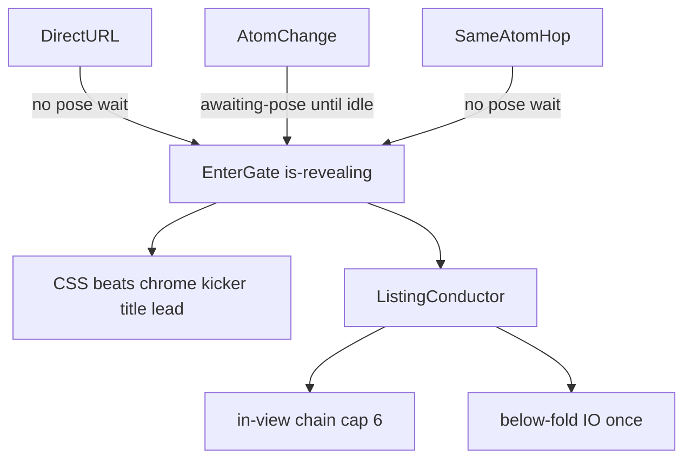

# Page entrance motion

Source of truth for how HTML/UI appears on off-home routes. Persistent molecular HUD (logo, grid, ticks, rail) is **not** replayed here — it already hides on `.is-approaching` and returns with the pose. Home (`/`) has no page overlay choreography.

**Hairline draw** on enter is the motion layer of the site-wide hairline language — static rules and tokens are defined in [`DESIGN.md` § Hairline language](DESIGN.md#hairline-language). Same `--wl-line`, same left → right wipe, same line-before-content cadence everywhere listings appear.

Tokens live on `:root` in [`app/assets/css/main.css`](../app/assets/css/main.css). Archive listing CSS: [`archive.css`](../app/assets/css/archive.css). Case first-viewport CSS: [`case.css`](../app/assets/css/case.css). Gate: [`usePageContentReveal`](../app/composables/usePageContentReveal.ts). Listing split: [`useListingReveal`](../app/composables/useListingReveal.ts).

## Two entries, one sequence

| Entry | Pose wait | When HTML starts |
|-------|-----------|------------------|
| Direct URL / refresh | No (`fromMatched === 0` in [`poseReveal`](../app/lib/navigation/poseReveal.ts)) | `onMounted` — do **not** hide content while the canvas is still `ClientOnly` |
| Atom change (home approach or off-home retarget) | `.app-shell.is-awaiting-pose` until Navigator idle | Same beats, no extra hold (user already watched the molecule) |
| Same atom (`/portfolio` ↔ case, `/services` ↔ slug) | No | Archive uses this system; case body stays on [`useCasePageTransition`](../app/composables/useCasePageTransition.ts) + ScrollTrigger |

`.is-revealing` on the page shell is the **EnterGate**. Choreography is identical after the gate opens. Portfolio wash ([`usePortfolioWashGate`](../app/composables/usePortfolioWashGate.ts) ~700ms) is atmosphere *after* the first rows, not a second act.

## Beats (t = 0 at gate)

Do not fade the whole `.archive-page__body` — chrome sits outside the body and must enter on its own.

| Beat | Target | Delay | Motion |
|------|--------|-------|--------|
| 0 chrome | `SiteChrome` (`.case-chrome__header--meta`) | `--enter-beat-chrome` (0) | opacity |
| 1 kicker | `.archive-heading__kicker`, `.case-header__index` | `--enter-beat-kicker` (40ms) | opacity |
| 2 title | `SiteScrambleTitle` | `--enter-beat-title` (80ms) conceptually | existing scramble, pose-gated — **no extra CSS fade** |
| 3 lead | intro, tags, section titles, case intro/facts, `.editorial-hero-media__fill` (after frame draw) | `--enter-beat-lead` (140ms) for copy; fill delay = `--line-draw-duration` + overlap |
| 4 list | `.archive-row` | `--enter-beat-list` (180ms) + stagger | hairline `scaleX`, then row content |
| 5 tail | `[data-enter="tail"]` (pagination, about CTA, archive `DetailNav`) | same split as list | opacity + `--enter-y` |

Case pages share the same listing conductor as archives (numbered sections + NEXT footer rows). Hero beats 0–3 stay separate; gallery / slices / mobile mockup keep ScrollTrigger L2/L3. GSAP remains allowed **only** for case ScrollTrigger L2/L3, case→case, `Navigator`, and pointer lerp (`gsap.quickTo` on nested tilt — landing / device / slice focus; not on the ScrollTrigger node).

Pointer / gyro ([`useCaseInteractive`](../app/composables/useCaseInteractive.ts)) starts only after pose settle + body `idle`, pauses while the lightbox is open, and unbinds off-screen. **Do not crop** landing or repeater screens; the only cut media is mobile slices.

## Listing split (chain vs viewport)

Do **not** assign `animation-delay: index * n` to every row. A below-fold item would sit idle for hundreds of ms after it enters view.

After gate + archive-return restore + two rAFs:

1. Collect `.archive-list .archive-row`, `[data-enter="tail"]` (except `.case-nav`, handled below), on case pages `.case-section:not(.case-nav)` + `nav.case-nav.case-section`, CMS prose blocks (`p`, headings before lists) and list rows in case prose/caption, and `nav.case-nav--archive` on service detail pages.
2. In-view = intersects the viewport with an ~8% bottom inset.
3. In-view items in DOM order: `data-reveal="chain"`, `--reveal-i: min(i, cap-1)`. Cap **6**, stagger `--enter-stagger` (55ms).
4. Below-fold: one `IntersectionObserver` (`rootMargin: 0px 0px -8% 0px`), `once`. On intersect: `data-reveal="in"`, delay **0**.
5. Played → `data-reveal="done"`. Never replay.

Uprock motif — implementation of [hairline language](DESIGN.md#hairline-language): the **full-width** row hairline (`::before` / last-row `::after`), wiped **left → right** via `clip-path: inset(0 100% 0 0)` → `inset(0 0 0 0)`. Short `.archive-row__line` tick uses `scaleX(0 → 1)` with `transform-origin: left center`. Row content starts after `--reveal-content-delay` so the draw reads first.

Same motif on case section markers, CMS list rows, and footer nav. **Footer nav** (`nav.case-nav`) is one listing unit; when `is-revealed`, an internal chain runs via `--nav-origin` + step offsets: case — marker line → marker label → Next → Previous line → Previous → Index; service — Next → Previous line → Previous → Index.

`archive-row--detail:last-child` has no bottom hairline (unchanged).

### Archive return and pagination

- [`archiveReturn`](../app/lib/navigation/archiveReturn.ts) restore jumps instantly, then measure. Chain only rows actually in view after the jump — not from page index 0 at scroll 0.
- Pagination replaces rows → conductor classifies **new** nodes only.
- Empty / pending list: no-op.
- `prefers-reduced-motion`: everything visible, no IO, no delays.

## Tokens

Line tokens are part of the global design language ([`DESIGN.md` § Hairline language](DESIGN.md#hairline-language)). Motion-only tokens below.

| Token | Value | Use |
|-------|--------|-----|
| `--enter-stagger` | `55ms` | In-view chain step |
| `--enter-duration` | `0.55s` | Fade / fade-up |
| `--enter-ease` | `cubic-bezier(0.22, 1, 0.36, 1)` | Shared ease |
| `--enter-y` | `10px` | Lead / row / tail lift |
| `--enter-beat-chrome` … `--enter-beat-list` | `0 / 40ms / 80ms / 140ms / 180ms` | Beat clock |
| `--line-draw-duration` | `1.25s` | Full hairline wipe — shared with static `--wl-line` rules |
| `--line-draw-ease` | `cubic-bezier(0.33, 0, 0.18, 1)` | Draw easing |
| `--reveal-cap` | `6` | Max distinct chain delays |
| `--reveal-content-delay` | `500ms` | Line → content overlap (~40% into draw) |

## Performance

- Full hairlines: `clip-path` wipe left → right. Short ticks: `scaleX` + `transform-origin: left`. No `width` / `border` animation.
- One IntersectionObserver per `ArchiveShell`, not ScrollTrigger, not GSAP on listings.
- Do not animate off-screen rows.
- Cap the chain; do not sequence 12 acts.
- `will-change` only while an item is playing; clear on `animationend`.
- Specimen enter = opacity + small translate — no filters, no scale.
- Hover `width` on `.archive-row__line` must not run during enter (gated on `.is-revealed`).

## Reduced motion / no-JS

- `prefers-reduced-motion: reduce`: no keyframes; final state immediately.
- Without `.js-enabled`: hairlines at `scaleX(1)`, all content visible (SSR / no-JS).

## What not to animate

- Persistent HUD / molecule / connector.
- Title scramble (already gated).
- Case gallery, mobile mockup (lift), slices (L3 scrub) — ScrollTrigger owns inner motion; listing reveal handles section shell + marker line only.
- Portfolio wash timing (existing gate).
- Navigator / `poseReveal` direct-load semantics.
